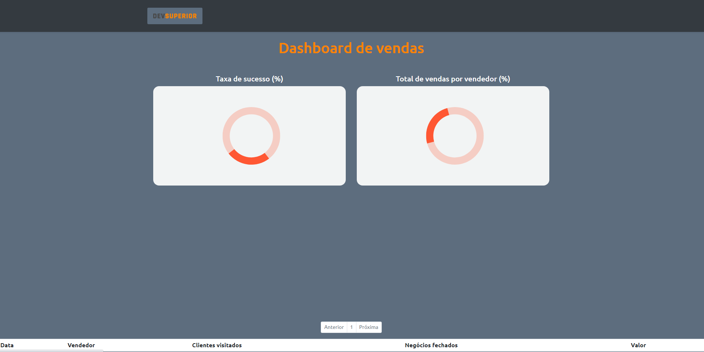
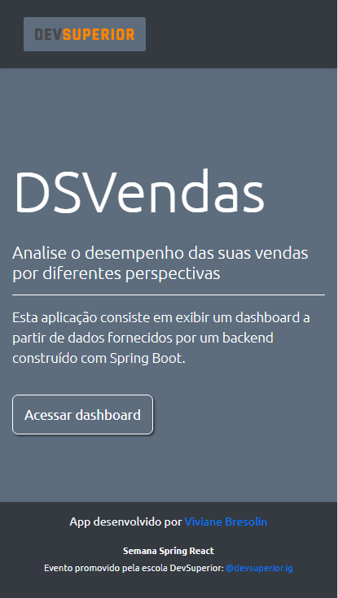
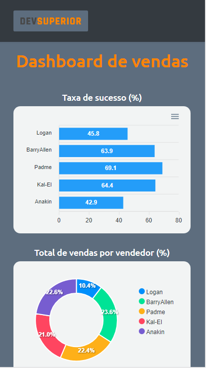
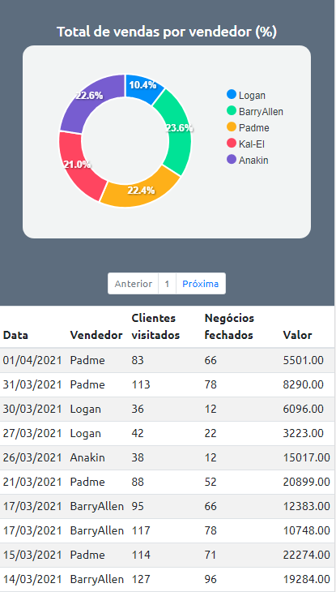

# Dashboard de Vendas

  
  
  
  

O **Dashboard de Vendas** é uma aplicação que foi desenvolvida durante a "Semana Spring React". Esse evento foi organizado pela [DevSuperior](https://devsuperior.com.br/), uma escola que tem como objetivo ajudar estudantes e profissionais de programação a ingressar ou se recolocar na carreira.

Caso queira visualizar a aplicação diretamente em seu navegador, basta clicar neste link:
https://vvbresolin-dashboard.netlify.app/

 

## Imagens da aplicação

### Homepage

 

### Dashboard

 

### Loaders

 

### Mobile

  

## :man_technologist: Tecnologias e ferramentas utilizadas:

### Frontend
- React
- Typescript
- CSS / SASS
- Bootstrap
- Apex Charts
- VS Code

### Backend
- Java
- Spring Boot
- JPA / Hibernate
- Maven
- Eclipse
- Insomnia

### Deploy
- Backend: Heroku
- Frontend: Netlify
- Banco de dados: PostgreSQL 

  

## Modelo Conceitual

  

## Padrão de camadas

 

    
  

Made with 🧡 and :coffee: | Find me on <a href="https://www.linkedin.com/in/vivianebresolin/"> LinkedIn</a>

